# The Shared Library

The **Shared Library** is a collection of quests and campaigns shared by decks for other decks to use. Teachers on any deck can browse it, import what they like into their own deck, and share their own quests and campaigns back.

It's an experimental feature, turned off on new decks. Only teachers see the Library, and nothing you import reaches your students until you publish it.

## How it works

The Library shares **complete packages**: a campaign, or a single quest, that stands on its own. What a package can't carry is how it fits into one particular deck: its badges, its ranks, and prerequisites pointing at content that wasn't part of the package. That's different on every deck, so the deck receiving the package does it.

That's why imported content always arrives unpublished, why an imported campaign has no prerequisite in front of it, and why the last two steps of every import are yours.

## Turn it on

Only the deck owner can turn the Library on:

1. Open **Admin > Site Configuration**.
2. At the bottom of the page, press **Advanced** to open it.
3. Tick **Enable Shared Library**, and press **Update**.

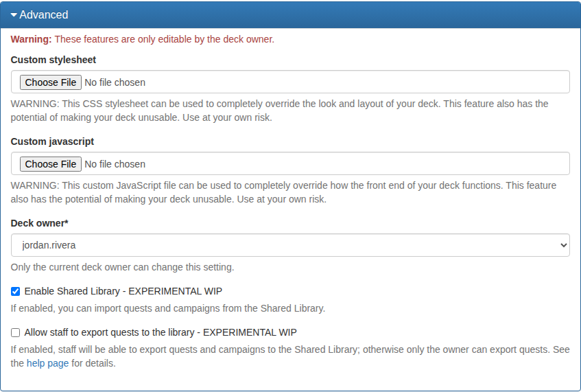

Enable Shared Library
:   The master switch. With it off, your deck has no Library: no menu item, no importing, no sharing.

Allow staff to export quests to the library
:   Who may share from your deck. Off, only the owner can; on, any teacher can.

Once it's on, **Library** appears in the left menu for teachers:

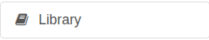

## Browse the Library

The Library has two tabs, **Quests** and **Campaigns**. The search box searches the whole Library: quest names, campaign names and tags.

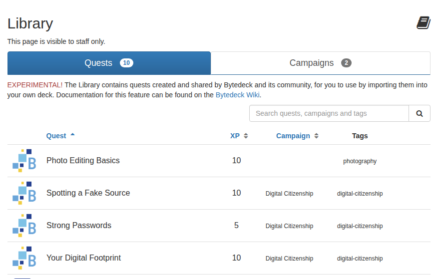

Click a quest to see its summary and an **Import Quest** button:

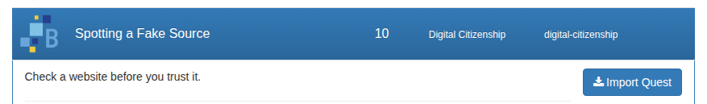

The **Campaigns** tab lists each campaign with how many quests it holds and their total XP. Of the two buttons beside each, the blue one opens the campaign to read its quests, and the other imports it.

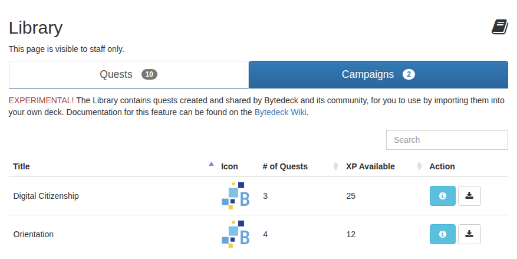

Opening a campaign lists its quests. Click one to import just that quest, rather than the whole campaign.

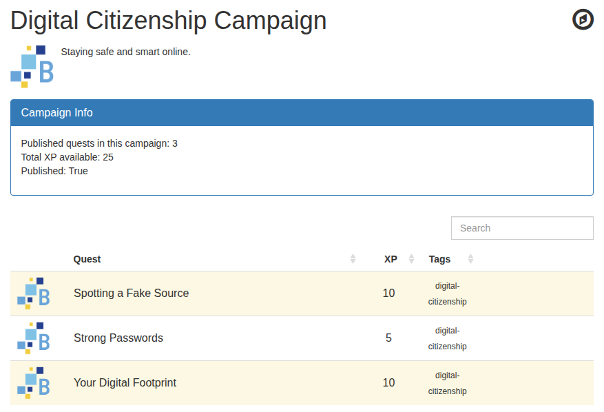

## Import from the Library

Importing **copies** a quest or campaign into your deck. The copy is yours: editing it never changes the Library's version, and the Library's version never changes under you.

### Import a quest

1. In **Library**, on the **Quests** tab, click a quest and press **Import Quest**.
2. Check the quest on the next page, which shows it as it will arrive, with its XP, tags and prerequisites, and press **Import**.

    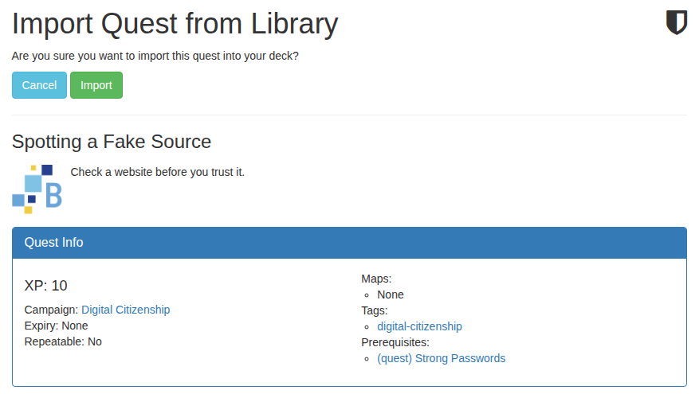

3. The quest waits in your **Drafts** tab, and the message says what's left to do:

    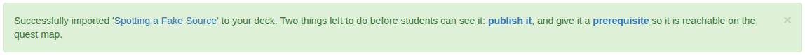

A quest imported on its own arrives without a campaign, even if it's part of one in the Library. Import the campaign to bring the campaign.

### Import a campaign

Importing a campaign brings every published quest in it, with the prerequisites that link them, so they still open up in order.

1. In **Library**, on the **Campaigns** tab, press the import button beside the campaign.
2. Check the campaign on the next page, and press **Import**.

    If your deck already has some of its quests (because you imported them on their own first), the page says so. Importing replaces your copy's wording, name, tags and questions with the Library's, but keeps your own prerequisites on it and whether you'd published it. Tick **Keep my version** for any you'd rather leave exactly as they are:

    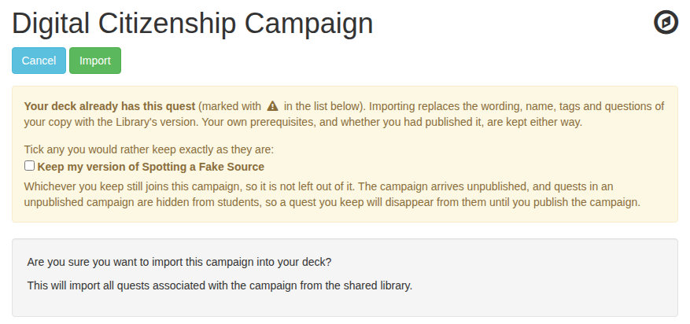

3. The campaign waits under your **Inactive** campaigns:

    

### Your two steps after an import

The message after every import links to both:

1. **Publish it.** A quest is in **Drafts**; a campaign is under **Inactive** campaigns. For a campaign, use the green **Publish Campaign and all its Quests** button on the campaigns list or the campaign's page: ticking *Published* on the campaign's edit form publishes the campaign but leaves its quests as drafts.
2. **Give it a prerequisite.** Imported content has none, so it doesn't sit anywhere on your quest maps yet. Put it after whatever fits your course: one of your quests, a badge, a rank or a course. For a campaign, give its **first** quest a prerequisite; the rest follow in order behind it.

### When your deck already has it

The Library recognises its own content by an **Import ID**, so it knows which of your quests came from where.

* **A quest you've already imported can't be imported again.** The page says so and links to your copy. To get the Library's version back, delete your copy first. For a second copy, use **Copy** on your own quest.

    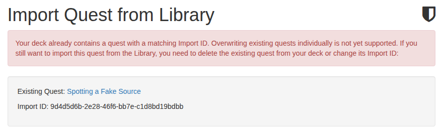

* **A campaign you've already imported can't be imported again** either. The page shows your copy instead.
* **A name your deck already uses doesn't stop an import.** The arriving copy gets today's date added, such as `Photoshop Basics (Imported on 2026-10-08)`, and you're told. Rename it to suit your deck.

## What travels, and what doesn't

Comes with a quest
:   * Its name, details, submission instructions and instructor notes.
    * Its XP (including whether students enter their own), icon, dates, repeat settings and other availability settings, and whether it needs your approval.
    * Its [submission questions](submission-questions.md), with their solutions and marker notes.
    * Its tags.
    * Its campaign, when you import the campaign.
    * Prerequisites pointing at other quests in the same import, whole: including a NOT, a count ("this quest 3 times") and an OR alternative.

Stays behind
:   * Badges: they never travel, so a prerequisite on one of your badges arrives without it.
    * Prerequisites pointing outside what was shared: a rank, a grade, a group, a course, or a quest that wasn't part of it.
    * Shared **Common Info** blocks. Paste their text into the quest itself before sharing if you want it to travel.
    * Who wrote it, and the teacher to notify: those are people on the other deck.
    * A campaign's position on the quest map.
    * Everything about students: no submissions, marks, comments, XP or badges are ever copied.

!!! warning "Instructor notes travel"
    A quest's instructor notes, and its questions' solutions and marker notes, are readable by teachers on every deck that imports it. Check them before you share.

## Share to the Library

What you share goes to every other deck under the [Creative Commons Attribution-ShareAlike 4.0 licence](https://creativecommons.org/licenses/by-sa/4.0/), and you're asked to agree to that first.

The deck owner can always share. Other teachers can share only if the owner has ticked **Allow staff to export quests to the library**.

### Share a quest

1. On **Quests**, click your quest, and press its upload button (**Export this quest to the Library**):

    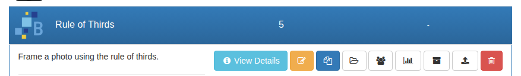

2. Read the licence, tick to agree, and press **Share Quest to Library**:

    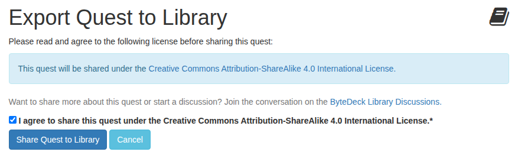

A quest shared on its own doesn't take its campaign with it. Archived quests can't be shared; a draft can.

### Share a campaign

On **Admin > Campaigns**, press the campaign's upload button (**Export this Campaign to the Library**), agree to the licence, and press **Share Campaign to Library**. The campaign's published quests go with it; drafts and archived quests stay behind, and you're told which archived quests were left out. The button is greyed out on a campaign with no published quests.

### What happens next

Shared content doesn't appear in the Library straight away. It arrives unpublished, and the people who look after the Library are told, so they can review and publish it:

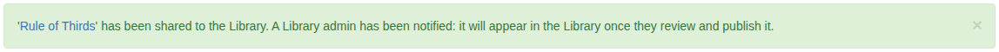

Your deck's name, your username and the date are kept with it, so other decks can see where it came from.

After sharing, ByteDeck tells you about anything that couldn't travel: prerequisites pointing outside what you shared, Common Info blocks, and archived quests left out of a campaign. None of them stop the share; they're there so you can decide whether to share more.

### Sharing again

A quest or campaign already in the Library can't be shared again; the page says so. Sharing an updated version isn't supported yet. A *new* campaign that happens to include quests already in the Library can be shared: those quests go in as separate copies, such as `Photoshop Basics (Exported on 2026-10-08)`.

## Things to know

The Library is experimental. Before you rely on it:

* **Updates don't flow.** Nothing is shared or imported twice, so a fix made on one deck doesn't reach decks that already imported the quest.
* **Badges stay on their own deck**, in both directions. Badges for imported work are yours to set up.

Something not covered here? Ask on the [discussion forum](https://github.com/bytedeck/bytedeck/discussions).
