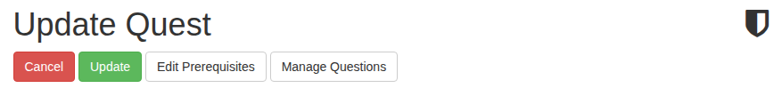
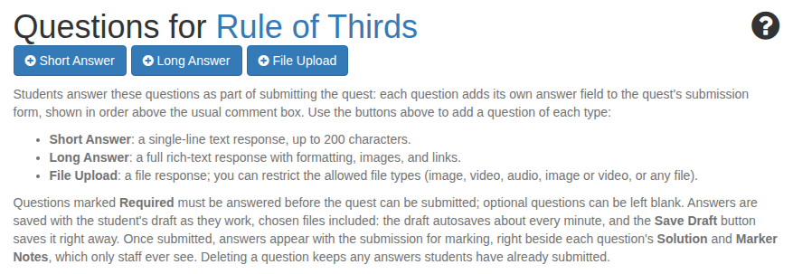
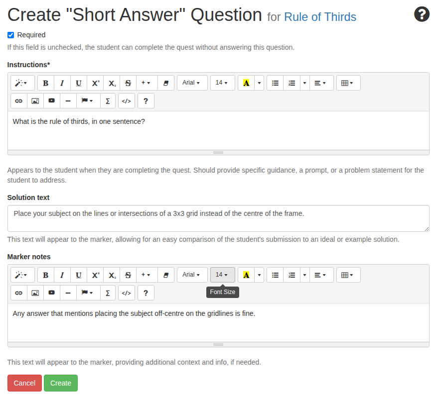
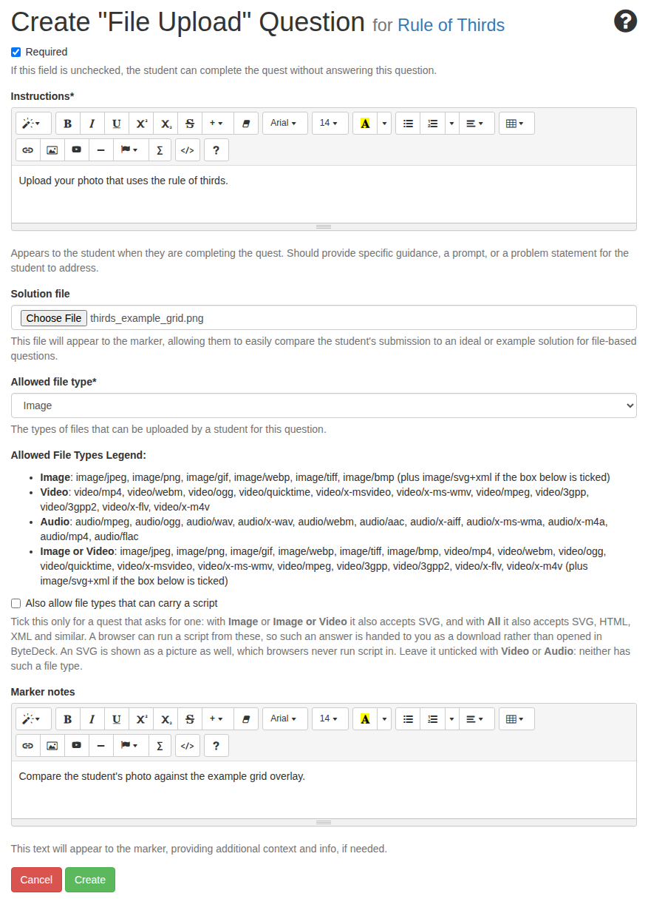
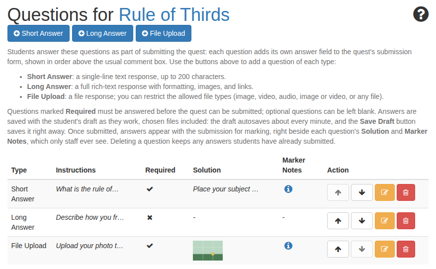
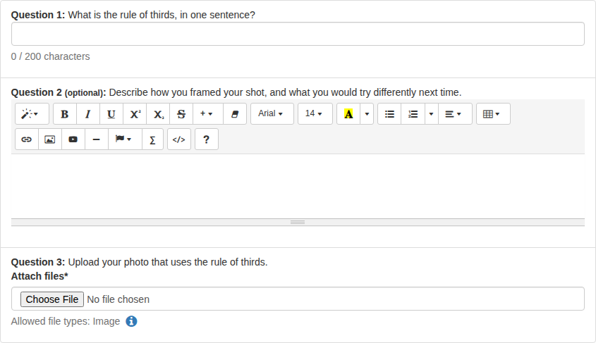
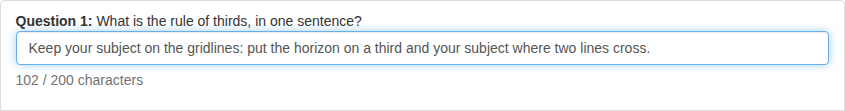
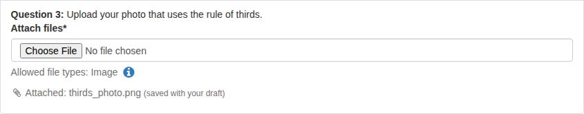
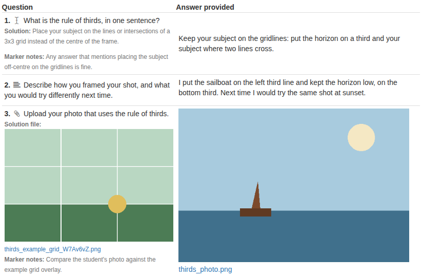

# Submission questions

**Submission questions** let a quest ask for exactly the answers you want, instead of hoping a student's comment covers them. Each question you add becomes its own answer field on the quest's submission form: a one-line text box, a rich-text editor, or a file upload. Students see them in your order, above the usual comment box.

Questions are set up by teachers; students only meet them while completing a quest. Solutions and marker notes are for the person marking, and students never see them.

## How questions fit into a quest

Without questions, a student submits a quest by writing one comment, with files attached if they like. Questions don't replace that: the comment box and its attachments stay. Questions add structure above it, and when the student submits, each answer comes back beside the question it answers, with your solution right there to compare.

A question is one of three types:

Short Answer
:   A single line of text, up to 200 characters. Good for a definition, a link, or one precise fact.

Long Answer
:   A full rich-text response in the same editor as the comment box, so formatting, images and links all work.

File Upload
:   One file, of a kind you choose: **Image**, **Video**, **Audio**, **Image or Video**, or **All**. A file can be up to 16 MB.

Each question is either **required** (the quest can't be submitted until it's answered) or optional (marked *(optional)* on the form, and can be left blank).

## Add questions to a quest

**Manage Questions** is in two places: in the row of buttons at the top of the quest's edit form,

and on the **Submission Questions** panel of the quest's own page:

Either one opens the quest's **Questions** page. On a quest with no questions yet, it explains the three types:

!!! note
    A new quest has to be saved before you can add questions to it.

### Create a question

1. Press the button for the type you want: **Short Answer**, **Long Answer** or **File Upload**.
2. Write the **Instructions**. This is what the student sees, so put the actual prompt or problem here. It's a full editor, so you can include images, links and formatting.
3. Decide whether the question is **Required**. It starts ticked: untick it to make the question optional.
4. Give the marker something to compare against, if you like:
    * **Solution text** (text questions) or a **Solution file** (file questions): an ideal or example answer, shown beside the student's answer when you mark it.
    * **Marker notes**: anything else the person marking should know, such as what counts as an acceptable answer.

    

5. For a **File Upload** question, choose the **Allowed file type**. The legend under it lists exactly which file formats each choice accepts.

    

6. Press **Create**.

!!! warning "Files that can carry a script"
    **Also allow file types that can carry a script** adds SVG to the image choices, and SVG, HTML, XML and similar to **All**. A browser can run a script from these, so ByteDeck hands such an answer to you as a download rather than opening it. Tick it only for a quest that asks for one, such as a web design quest.

A question's type is fixed once it's created. To turn a short answer into a long answer, delete it and create a new one.

### Reorder, edit and delete questions

Once a quest has questions, the Questions page lists them with their type, instructions, whether they're required, and their solution and marker notes:

* The **arrows** move a question up or down. Students see the questions in this order, numbered from the top.
* The **pencil** opens the question for editing.
* The **bin** deletes it, after you confirm. Answers students have already submitted are kept, labelled *(question was deleted)*.

## What students see

The submission form gains one numbered answer field per question, in your order, above the usual comment box. Required questions must be answered before the quest can be submitted; optional ones say *(optional)*:

Short answers
:   A counter under the box shows how much of the 200 characters is used, and the box stops accepting typing when it's full.

    

Long answers
:   The same editor as the comment box, so students can format their answer and include images and links.

File uploads
:   The field says what it accepts, and the info icon beside it lists the exact file formats. A file of the wrong type, or over 16 MB, is refused with a message saying why, so the student can pick another.

### Answers save with the student's draft

Students don't lose work in progress. Their answers are saved with their draft as they work: the draft saves itself about once a minute, and **Save Draft** saves it at once. A chosen file is saved straight away, and a note under the field says so:

When the student comes back later, their text answers are filled back in and their saved files are still attached. Choosing a new file for the same question replaces the saved one.

If submitting sends the student back to the form (a required answer was left blank, say), the files they chose are kept, so nothing needs choosing twice.

## Mark the answers

When a student submits, their answers appear with the submission on **Quest Approvals**, each beside the question it answers. Your solution and marker notes are under each question, so comparing takes one glance:

Images are shown in place, video and audio get a player, and every file has a link to the original. Any other kind of file is shown as its link.

Students see the same table on their own submission, headed **Your answer**, without your solutions or marker notes.

Approve, comment on or return the submission as usual: see [Review submissions](../quick-start/review-submissions.md).

## Questions travel with the quest

* **Copying a quest** copies its questions too, so the copy asks the same things.
* **Sharing a quest to the Shared Library** carries its questions, and importing it brings them along.

!!! note
    A question's solution and marker notes travel with it. Like a quest's instructor notes, teachers on every deck that imports the quest can read them, so check them before you share.
