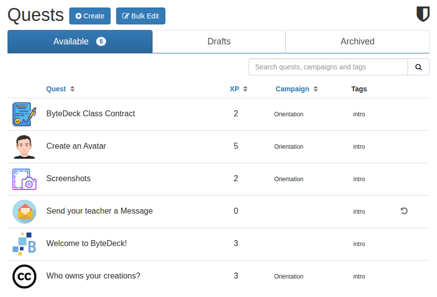
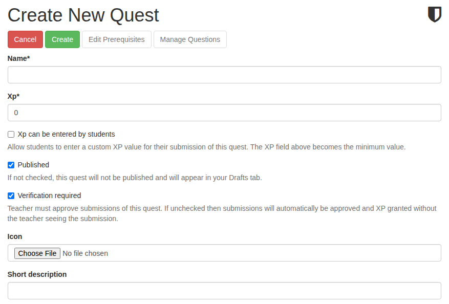
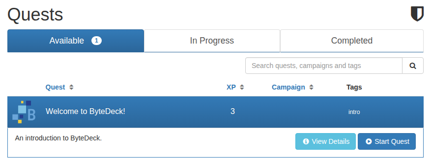
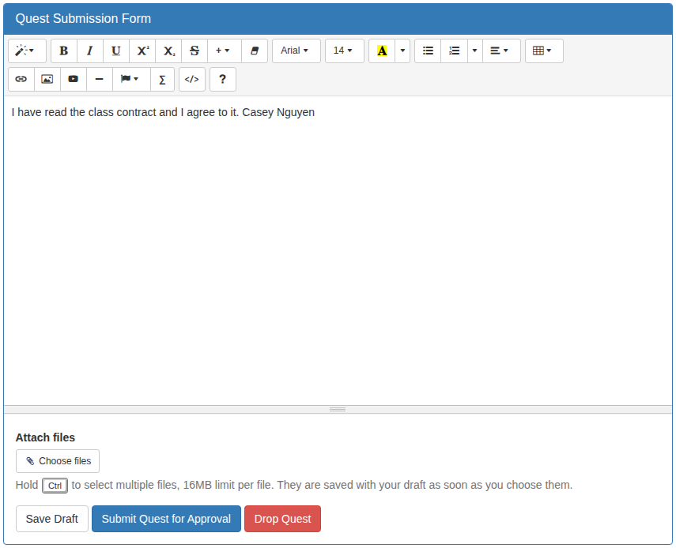

# Your first quests

A **quest** is a lesson or assignment: instructions for the student, and a submission they hand in. When you approve the submission, the student earns the quest's XP, and the quests that follow it become available.

## The starter quests

Choose **Quests** in the left menu. A new deck already has a few quests, ready for your students:

* **Welcome to ByteDeck!** is every student's first quest. It's approved automatically as soon as they submit it. Edit it to introduce your class: it's the first thing students read.
* Submitting it opens the **Orientation** campaign: **ByteDeck Class Contract**, **Create an Avatar**, **Screenshots** and **Who owns your creations?**. These teach students how to submit work, and you approve each one.
* Completing all four earns the **ByteDeck Proficiency** badge, which opens **Send your teacher a Message**, a quest students can repeat whenever they want to reach you.

Use these as they are, edit them, or archive the ones you don't want. To open a quest, click its row, then use the buttons that appear to view, edit, copy or archive it.

## Create a quest

On the Quests page, press **Create**.

The fields you need for a first quest:

Name
:   What students see in their list of quests.

XP
:   How much XP the student earns when the quest is approved.

Published
:   Leave it ticked for students to see the quest. Untick it to keep working on it: it waits in your **Drafts** tab until you publish it.

Verification required
:   Leave it ticked to review each submission before the student gets the XP. Untick it for quests that should be approved automatically, like the Welcome quest.

Quest Details
:   Everything the student needs to do the quest: instructions, images, videos and links.

Submission Instructions
:   What the student should hand in, and how.

Instructor notes
:   Notes only teachers can see, such as an answer key or what to look for.

Press **Create** to save the quest.

!!! warning "New quests wait for the ByteDeck Proficiency badge"
    Under **Basic Prerequisites** at the bottom of the form, every new quest starts with the **ByteDeck Proficiency** badge as its prerequisite, so students see it only after they finish the Orientation campaign. To make a quest available as soon as a student joins, clear that badge before you press Create. To change the starting prerequisite for all new quests, use **Default quest prerequisite** in Site Configuration.

## What students see

A student's **Available** tab lists the quests open to them. They click a quest to read its summary, then press **Start Quest**:

The quest moves to their **In Progress** tab. They read it, write their answer in the submission form at the bottom, attach any files, and press **Submit Quest for Approval**:

**Save Draft** keeps their work without submitting it, so they can come back later. A quest that needs your approval now waits for you.

Next: **[Review submissions](review-submissions.md)**.
