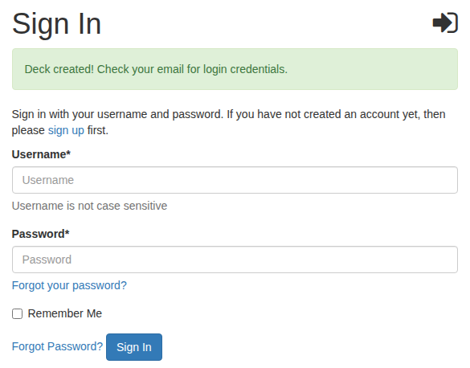
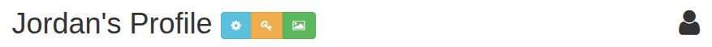
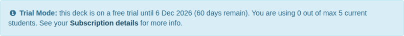

# Get your deck

Your deck is your own ByteDeck site. Requesting one takes a few minutes, and it starts on a free trial.

## 1. Request a deck

Go to [bytedeck.com/decks/request](https://bytedeck.com/decks/request/), enter your first name, last name and email address, and press **Submit Request**. The request page also lists the current terms of the free trial: how long it lasts and how many students it allows.

ByteDeck emails you a verification link. Open it within an hour; if it expires, request again.

## 2. Name your deck

The link opens a short form with your name and email already filled in. Choose your deck's **name**: it becomes your deck's address, so the name `science` gives you `science.bytedeck.com`.

The name can use lowercase letters, numbers and dashes, up to 30 characters. It must start with a letter, and can't end with a dash or have two dashes in a row. Pick something short your students can type.

Press **Create** and wait a moment while your deck is built.

## 3. Sign in

Once your deck is ready, you land on its sign-in page, and ByteDeck emails you your username and password:

Your username is your first and last name with a dot between them, for example `jordan.rivera`. Sign in with it and the password from the email.

!!! tip "Bookmark your deck"
    Your deck lives at its own address, such as `science.bytedeck.com`, not at bytedeck.com. Bookmark it: it's where you and your students sign in from now on.

## 4. Change your password

The emailed password works, but change it to one only you know:

1. Choose **Profile** in the menu on the left.
2. Press the yellow key button beside your name.

    

3. Enter the emailed password, then your new password twice, and press **Change Password**.

Your email address is already confirmed, so if you ever forget your password you can reset it yourself with **Forgot your password?** on the sign-in page.

## What you'll see

After you sign in, you land on **Quest Approvals**, the page where your students' work waits for you. It's empty for now. Across the top of every page, a banner tells you how long your trial has left and how many students you are using:

**Subscription details** in the banner (also **Admin > Subscription**) shows your trial and how to subscribe when you need more students or more time.

Next: **[Set up your deck](set-up-your-deck.md)**.
