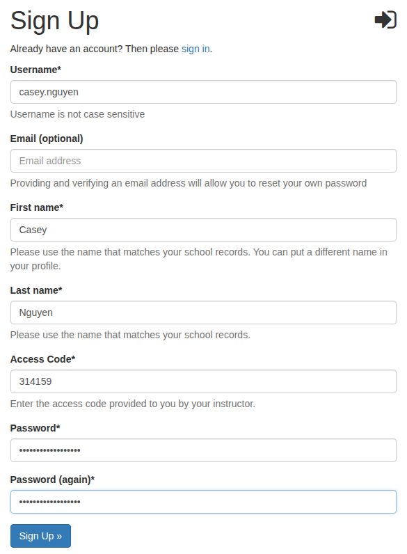
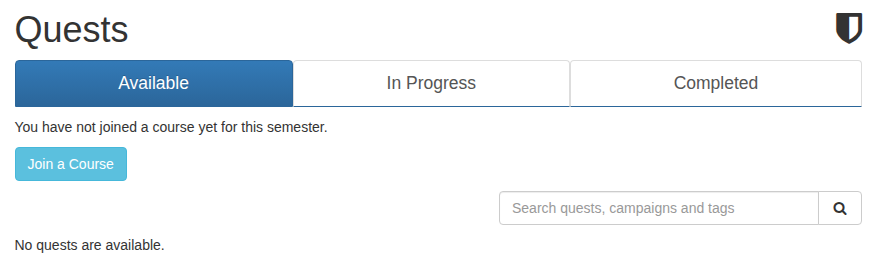
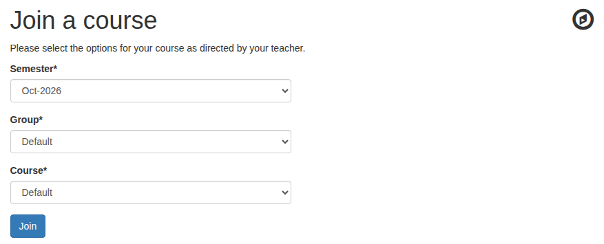

# Invite your students

Students create their own accounts. Give them two things:

* your deck's address, for example `science.bytedeck.com`;
* the access code you chose in [Set up your deck](set-up-your-deck.md#choose-an-access-code).

## Students sign up

On your deck, a student presses **Sign Up** at the top right (or the **sign up** link on the sign-in page) and fills in the form:

Username
:   What they'll sign in with. Many classes use the student's first and last name with a dot between them, like `casey.nguyen`, so you can tell who's who.

E-mail
:   Optional, but worth asking for: a student with an email address can reset their own password. Without one, you reset it for them from their profile.

First name and Last name
:   The names on your class list. A student can add a preferred name to their profile later.

Access Code
:   The code you gave them.

## Students join a course

Right after signing up, a student sees that they haven't joined a course yet. Until they do, they have no quests:

They press **Join a Course** and choose the semester, group and course. A new deck has one of each, so they only need to press **Join**:

Their first quest, **Welcome to ByteDeck!**, is now waiting in their Available tab.

!!! tip "Skip the form when there's only one choice"
    Turn on **Simplified course registration** in Site Configuration and students only choose the fields that have more than one option. With a single semester, group and course, they join it automatically.

!!! note "Your student limit"
    A student counts toward your deck's student limit (shown in the trial banner) once they join a course in the current semester. When the deck is full, new students can still sign up, but they can't join a course until you subscribe or a seat frees up. Teachers never count.

## See who has joined

Choose **Students** in the left menu to see everyone who has joined a course this semester. Open a student's profile to see their progress, change their details, or reset their password with the yellow key button.

Next: **[Your first quests](first-quests.md)**.
