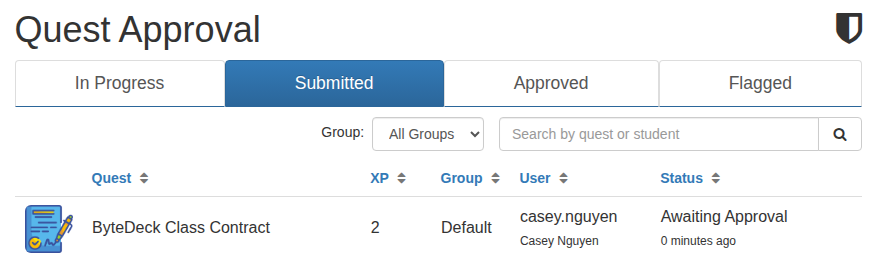
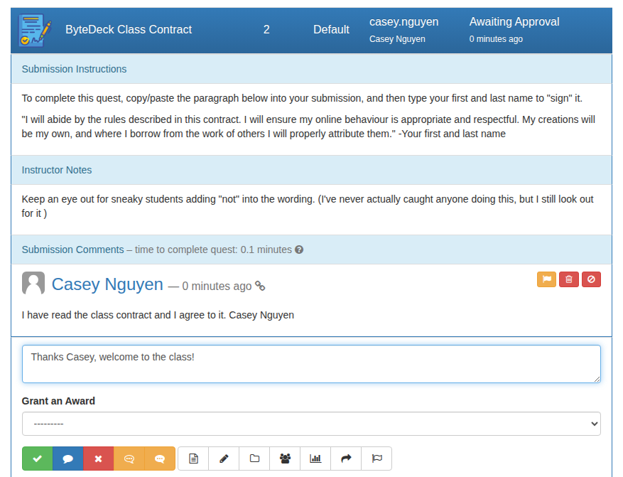
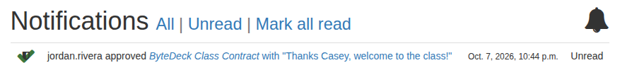

# Review submissions

When a student submits a quest that needs your approval, it waits for you on **Quest Approvals**, the first item in the left menu. A number beside it shows how many submissions are waiting.

## Find the work waiting for you

The **Submitted** tab lists every submission waiting for a decision, newest first (tick **Sort quests awaiting approval with oldest on top** in Site Configuration to reverse it):

The other tabs show work students have started but not submitted (**In Progress**), work you've approved (**Approved**), and submissions you've flagged to come back to (**Flagged**). The **Group** menu narrows the list to one group, which helps when several teachers share a deck.

## Approve or return a submission

Click a submission to open it. You see the quest's submission instructions, your instructor notes, and the student's work. Write a reply in the box under it, if you like:

Then choose what to do with it. Hover over a button to see what it does:

Approve (green tick)
:   Accepts the work. The student earns the quest's XP, and any quests or badges that follow it become available to them.

Comment (blue speech bubble)
:   Sends your reply without deciding yet. The submission stays waiting.

Return (red cross)
:   Sends the work back for the student to fix. It returns to their In Progress tab with your reply, and they submit it again when it's ready.

The orange buttons add ready-made text to your reply: one inserts your deck's quick reply (set in Site Configuration), the other the quest's own quick reply text (set when you edit the quest). **Grant an Award** gives the student a badge along with your decision.

If you approve or return without writing anything, ByteDeck adds a standard line for you, such as "(Approved - Your submission meets the criteria for this quest)". You can change both lines in Site Configuration.

## The student hears back

Your decision and reply reach the student as a notification: the number on the bell at the top of their page.

## You're up and running

That's the whole loop: your students sign up, join a course, work through quests, and you review what they submit. From here you can:

* write more quests, and group them into **campaigns** (Admin > Campaigns);
* decide which quests open up after which with **prerequisites**, and see the result on the quest **Maps**;
* make **badges** for students to earn, and adjust the **ranks** they climb (Admin > Ranks);
* post **announcements** to your whole class;
* add [custom pages and links](../your-deck/custom-pages.md) for the things students keep asking for.

More of this guide is on its way. Until then, the [ByteDeck wiki](https://github.com/bytedeck/bytedeck/wiki) covers semesters, groups and courses, quest creation, submission questions, the Shared Library, marks, maps and more.
