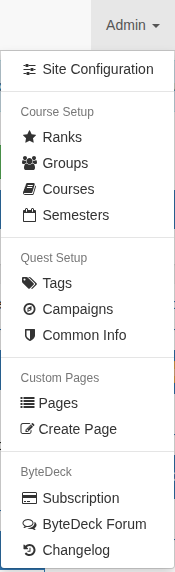
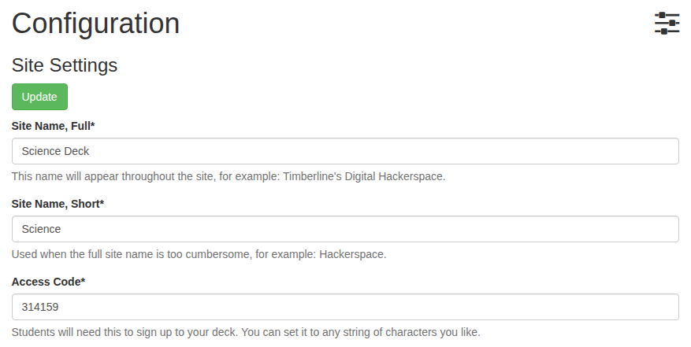

# Set up your deck

Your deck's settings live on one page, **Site Configuration**. For the quick start you only need three of them: your deck's name, its short name, and the access code.

## Open Site Configuration

Open the **Admin** menu at the top right and choose **Site Configuration**. The Admin menu is where you'll find your deck's other building blocks too: ranks, groups, courses and semesters under **Course Setup**, and tags and campaigns under **Quest Setup**.

## Name your deck

Site Name, Full
:   Your deck's name, shown throughout the site and in the browser tab, for example "Ms. Rivera's Science Lab". It starts out as your deck's address with "Deck" after it.

Site Name, Short
:   A shorter version for places where the full name won't fit, for example "Science Lab".

## Choose an access code

Students need the **access code** to sign up to your deck, so only people you give it to can join. Every new deck starts with the same code, `314159`, so change it to something of your own before you share your deck's address.

Pick something easy to type: you'll write it on the board or put it in a message to your class. If it gets out, change it here: students who have already signed up aren't affected.

Press **Update** at the top or bottom of the page to save.

## Optional: make it look like yours

The same page has more you can come back to any time:

* **Banner Image**, the picture at the top left of every page (262 pixels wide works best). It replaces the ByteDeck banner a new deck starts with.
* **Site Logo** and **Favicon**, the small images in the top left corner and in the browser tab.
* **Custom names** for "Badge", "Announcement", "Group", "Student" and "Tag", so the words on your deck fit your setting. For example, a high school might call its groups "Blocks", and a club might call its students "Members".

Each setting on the page has a short explanation under it.

Next: **[Invite your students](invite-students.md)**.
