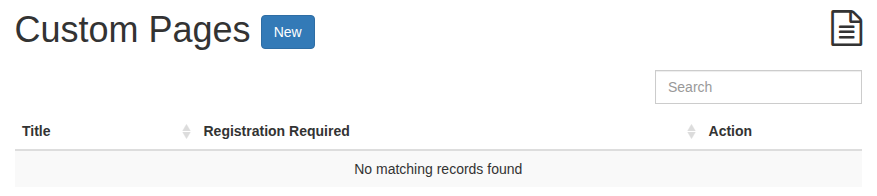
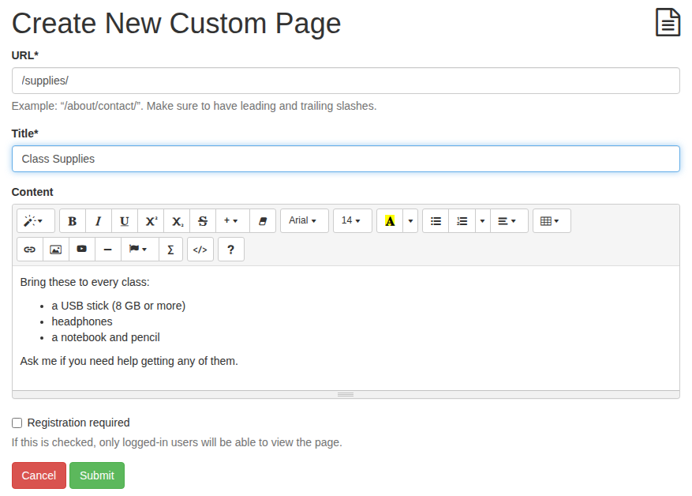
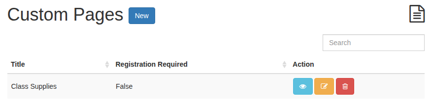
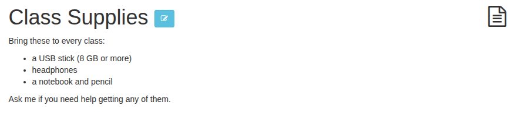
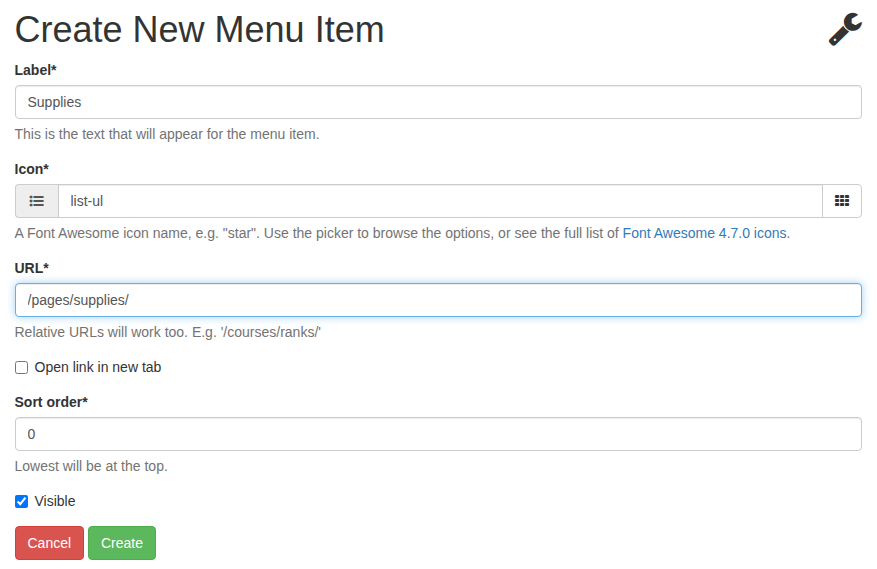
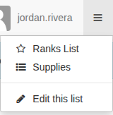

# Custom pages and links

A **custom page** is a page of your own on your deck: class expectations, a supply list, a course outline, help for a tricky piece of software. Link to it from a quest or an announcement, or add it to the deck's **Links** menu so it's always one click away.

## Create a page

1. Open **Admin > Pages** (under **Custom Pages**) to see your deck's pages. A new deck has none.

    

2. Press **New** (or choose **Admin > Create Page**) and fill in the page:

    

    URL
    :   The page's address on your deck, with a slash at each end. `/supplies/` gives you `yourdeck.bytedeck.com/pages/supplies/`.

    Title
    :   The heading at the top of the page.

    Content
    :   Anything you like, in the same editor as quests: text, lists, images, videos and links.

    Registration required
    :   Tick it to show the page only to people signed in to your deck. Leave it unticked and anyone with the link can read it, which suits a page you share with parents.

3. Press **Submit**. The page joins the list, with buttons to view, edit or delete it:

    

Here is the page as your students see it (teachers also get the edit button beside the title):

## Add it to the Links menu

The **☰** menu at the top right of every page (**Links** on a phone) holds your deck's handy links. A new deck has one, **Ranks List**. To add your page:

1. Open the **☰** menu and choose **Edit this list** (teachers only).
2. Press **New** and fill in the link:

    

    Label
    :   The words in the menu.

    Icon
    :   The small picture beside them. Press the button at the end of the field to browse the icons, or type an icon's name.

    URL
    :   Where it goes: a page on your deck, such as `/pages/supplies/`, or any other website (`https://...`). ByteDeck checks that a page on your deck exists before saving the link.

    Open link in new tab
    :   Handy for links to other websites.

    Sort order
    :   The menu lists its links from the lowest number down.

    Visible
    :   Untick it to hide a link without deleting it.

3. Press **Create**. The link is in everyone's menu straight away:

    

The menu can hold links to anywhere, not just your custom pages: a quest everyone keeps looking for, your school's website, or a shared folder.
